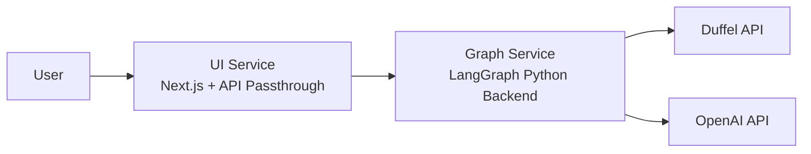

# Railway Deployment Guide - Complete Configuration

This guide provides a comprehensive walkthrough for deploying the mini_bookedai project to Railway, including all the configuration fixes and gotchas discovered during deployment.

## Architecture Overview

The mini_bookedai project consists of two separate Railway services:

- **UI Service** (`ui/`): Next.js frontend with API passthrough
- **Graph Service** (`graph/`): LangGraph Python backend



## Critical Prerequisites

### 1. Python Package Structure Fix

**REQUIRED**: The `graph/src/` directory must have an `__init__.py` file for proper Python package recognition:

```bash
# Create this file if it doesn't exist
touch graph/src/__init__.py
```

Add this content:
```python
# This file makes the src directory a Python package
```

### 2. Import Statement Fix

**REQUIRED**: Convert relative imports to absolute imports in `graph/src/agent/graph.py`:

```python
# ❌ WRONG - These cause import errors on Railway
from ..duffel_client.endpoints.stays import search_hotels
from ..duffel_client.client import DuffelAPIError
from ..config import config

# ✅ CORRECT - Use absolute imports
from src.duffel_client.endpoints.stays import search_hotels
from src.duffel_client.client import DuffelAPIError
from src.config import config
```

## Railway Service Configuration

### Service Names
- **UI Service**: `mini_bookedai_ui`
- **Graph Service**: `mini_bookedai_graph`

### Service Settings

#### UI Service Settings:
1. **Service Name**: `mini_bookedai_ui`
2. **Root Directory**: `ui`
3. **Watch Paths**: `ui/**`

#### Graph Service Settings:
1. **Service Name**: `mini_bookedai_graph` 
2. **Root Directory**: `graph`
3. **Watch Paths**: `graph/**`

## Railway Configuration Files

### UI Service: `ui/railway.json`
```json
{
  "$schema": "https://railway.app/railway.schema.json",
  "build": {
    "buildCommand": "pnpm install --frozen-lockfile && pnpm run build"
  },
  "deploy": {
    "startCommand": "next start -H 0.0.0.0 -p $PORT",
    "restartPolicyType": "ON_FAILURE",
    "restartPolicyMaxRetries": 10
  }
}
```

**Key Points:**
- Uses `pnpm` for faster installs
- NO health check (Next.js handles this properly)
- Binds to `$PORT` (Railway-assigned port)

### Graph Service: `graph/railway.json`
```json
{
  "$schema": "https://railway.app/railway.schema.json",
  "build": {
    "buildCommand": "uv sync --frozen"
  },
  "deploy": {
    "startCommand": "uv run langgraph dev --host 0.0.0.0 --port $PORT",
    "restartPolicyType": "ON_FAILURE",
    "restartPolicyMaxRetries": 10
  }
}
```

### Graph Service: `graph/nixpacks.toml`
```toml
[variables]
PYTHONPATH = "/app/src"
NIXPACKS_METADATA = "python,uv,nodejs"

[phases.setup]
nixPkgs = ["python312", "uv", "nodejs_18", "npm"]

[phases.install]
dependsOn = ["setup"]
cmds = ["uv sync --frozen"]

[start]
cmd = "uv run langgraph dev --host 0.0.0.0 --port $PORT"
```

**Key Points:**
- Uses `uv` for faster Python package management
- **Multi-language support**: Includes Node.js for building UI components
- **Custom UI components**: Enables compilation of `.tsx` files for LangGraph Studio
- NO health check (LangGraph doesn't provide standard health endpoints)
- LangGraph runs on port 8080 by default, but Railway networking handles this

## Critical Networking Configuration

### Railway Port Mapping Issue

**IMPORTANT**: LangGraph dev server runs on port 8080 by default, regardless of the `--port $PORT` argument. You must configure Railway's public networking to map to port 8080:

1. **Railway Dashboard** → Your graph service → **Networking**
2. **Public Networking** → Configure port mapping
3. **Set port to**: `8080` (not 2024)

Example:
```
minibookedaigraph-production.up.railway.app → Port 8080 • Metal Edge
```

### Why Port Mapping Matters

Railway's networking architecture:
```
External Request (Port 80/443) 
    ↓
Railway Edge Proxy 
    ↓  
Your Container (Port you configure - must be 8080 for LangGraph)
```

## Environment Variables Configuration

### UI Service Environment Variables

```bash
# API Connection (CRITICAL - must end with /api)
NEXT_PUBLIC_API_URL=${{RAILWAY_SERVICE_MINI_BOOKEDAI_UI_URL}}/api

# Assistant Configuration
NEXT_PUBLIC_ASSISTANT_ID=agent

# API Passthrough Configuration (Backend connection)
LANGGRAPH_API_URL=${{RAILWAY_SERVICE_MINI_BOOKEDAI_GRAPH_URL}}

# Authentication (for API passthrough)
LANGSMITH_API_KEY=lsv2_your_langsmith_key
```

**Critical Points:**
- `NEXT_PUBLIC_API_URL` MUST end with `/api` for API passthrough to work
- Uses Railway variable interpolation for dynamic URLs
- API passthrough routes UI requests to graph service with authentication

### Graph Service Environment Variables

```bash
# AI Model API Key
OPENAI_API_KEY=sk-proj-your_openai_key

# Duffel Travel API (EXACT VARIABLE NAME REQUIRED)
DUFFEL_API_TOKEN=duffel_live_your_duffel_token
DUFFEL_API_VERSION=v2

# Optional: LangSmith Tracing
LANGCHAIN_TRACING_V2=true
LANGCHAIN_API_KEY=lsv2_your_langsmith_key
LANGCHAIN_PROJECT=BookedAI-Production
```

**Critical Variable Naming:**
- ✅ `DUFFEL_API_TOKEN` (what the code expects)
- ❌ `DUFFEL_API_KEY` (common mistake - won't work)

## Deployment Process

### 1. Repository Setup
1. **Connect GitHub repository** to Railway
2. **Create two services** from the same repository
3. **Configure root directories** and watch paths

### 2. Code Fixes (REQUIRED)
```bash
# 1. Create package file
echo "# This file makes the src directory a Python package" > graph/src/__init__.py

# 2. Fix imports in graph/src/agent/graph.py
# Change relative imports (from ..module) to absolute imports (from src.module)
```

### 3. Service Configuration
1. **Set railway.json configs** for each service
2. **Configure networking** (port 8080 for graph service)
3. **Set environment variables** with exact naming

### 4. Deploy
- **Commit changes** to trigger deployment
- **Monitor logs** for successful startup
- **Test connections** between services

## API Passthrough Architecture

The UI service uses API passthrough to communicate with the graph service:

```
User Request → UI Frontend → /api/* → API Passthrough → Graph Service
```

### How It Works:
1. **UI makes requests** to its own `/api/*` endpoints
2. **API passthrough** (Next.js API routes) forwards requests to graph service
3. **Authentication** is handled by passthrough using `LANGSMITH_API_KEY`
4. **Responses** are returned through the passthrough to the UI

### File: `ui/src/app/api/[..._path]/route.ts`
```typescript
import { initApiPassthrough } from "langgraph-nextjs-api-passthrough";

export const { GET, POST, PUT, PATCH, DELETE, OPTIONS, runtime } =
  initApiPassthrough({
    apiUrl: process.env.LANGGRAPH_API_URL ?? "remove-me",
    apiKey: process.env.LANGSMITH_API_KEY ?? "remove-me",
    runtime: "edge",
  });
```

## LangGraph Configuration

### File: `graph/langgraph.json`
```json
{
  "dependencies": ["./src"],
  "graphs": {
    "agent": "./src/agent/graph.py:graph"
  },
  "env": ".env"
}
```

**Key Points:**
- `dependencies: ["./src"]` adds src to Python path (enables absolute imports)
- Graph ID `agent` matches `NEXT_PUBLIC_ASSISTANT_ID`

## Testing and Verification

### 1. Service Health Checks
```bash
# Test graph service directly
curl https://minibookedaigraph-production.up.railway.app/info

# Test UI API passthrough  
curl https://minibookedaiui-production.up.railway.app/api/info
```

### 2. Full Integration Test
1. **Access UI**: `https://minibookedaiui-production.up.railway.app`
2. **Send message**: "Find hotels in Sydney for one night tomorrow"
3. **Verify**: Agent calls tools and returns hotel results

### 3. Check Railway Variables
```bash
# Verify graph service variables
railway variables --environment production --service mini_bookedai_graph

# Verify UI service variables  
railway variables --environment production --service mini_bookedai_ui
```

## Common Issues and Solutions

### 1. Import Errors
**Error**: `ImportError: attempted relative import with no known parent package`
**Solution**: 
- Add `graph/src/__init__.py`
- Convert relative imports to absolute imports

### 2. Connection Errors (502 Bad Gateway)
**Error**: UI can't connect to graph service
**Solution**: 
- Check port mapping (graph service must be port 8080)
- Verify `NEXT_PUBLIC_API_URL` ends with `/api`

### 3. Duffel API Errors
**Error**: "Hotel search is currently unavailable"
**Solution**: 
- Use `DUFFEL_API_TOKEN` (not `DUFFEL_API_KEY`)
- Verify API token is valid

### 4. Environment Variable Issues
**Error**: Variables not found or incorrect
**Solution**: 
- Use Railway variable interpolation: `${{RAILWAY_SERVICE_NAME_URL}}`
- Check exact variable names match code expectations

## Production URLs

After successful deployment:
- **UI**: `https://minibookedaiui-production.up.railway.app`
- **Graph API**: `https://minibookedaigraph-production.up.railway.app`

## Package Managers

- **UI**: `pnpm` (faster than npm, deterministic installs)
- **Graph**: `uv` (fastest Python package manager)

## File Structure Reference

```
mini_bookedai/
├── ui/                          # Next.js frontend
│   ├── railway.json            # Railway deployment config
│   ├── package.json            # pnpm dependencies
│   ├── src/app/api/            # API passthrough routes
│   └── src/                    # UI source code
├── graph/                       # LangGraph backend
│   ├── railway.json            # Railway deployment config  
│   ├── pyproject.toml          # uv dependencies
│   ├── langgraph.json          # LangGraph config
│   ├── src/__init__.py         # ⚠️  REQUIRED package file
│   └── src/                    # Graph source code
└── RAILWAY_DEPLOYMENT.md       # This guide
```

## Troubleshooting Commands

```bash
# Check Railway service status
railway status

# View service logs
railway logs --environment production --service mini_bookedai_graph
railway logs --environment production --service mini_bookedai_ui

# Test environment variables
railway run --environment production --service mini_bookedai_graph env

# Redeploy specific service
railway redeploy --environment production --service mini_bookedai_graph
```

## Security and Production Considerations

1. **API Authentication**: Currently uses LangSmith API key passthrough
2. **CORS**: Configured automatically by API passthrough
3. **Rate Limiting**: Consider implementing for production use
4. **Monitoring**: Set up proper logging and error tracking
5. **Environment Separation**: Use different Railway projects for staging/production

## References

- [Railway Deployment Documentation](https://docs.railway.app/)
- [LangGraph Platform Deployment](https://langchain-ai.github.io/langgraph/concepts/deployment_options/)
- [LangChain Agent Chat UI](https://github.com/langchain-ai/agent-chat-ui)
- [Railway Environment Variables](https://docs.railway.app/guides/variables) 