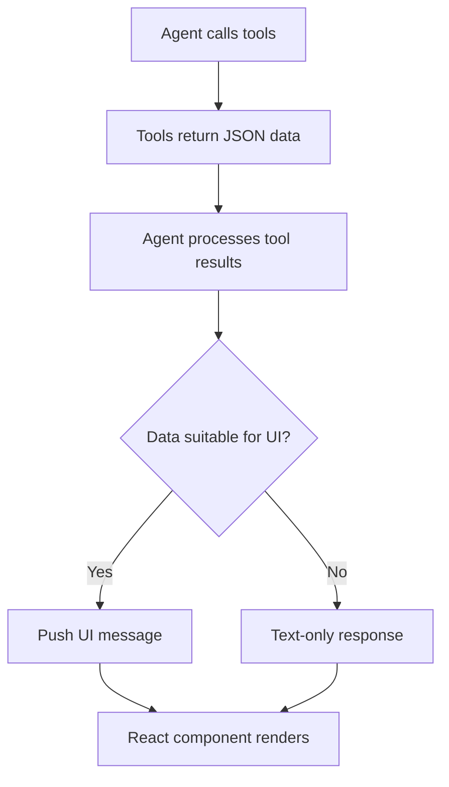

# UI Message Logic in BookedAI Agent

## Overview

The BookedAI agent uses LangGraph's **Generative UI** system to create rich, interactive components when displaying tool results. Instead of showing only text responses, the agent can generate React components that provide better user experiences for structured data like hotel listings, flight results, and other visual content.

## How It Works

### Basic Flow



1. **Agent calls tools** (e.g., `search_hotels_tool`)
2. **Tools return JSON data** with structured results
3. **Agent analyzes** each tool result to determine if UI is beneficial
4. **For suitable data**: Creates UI component + text response
5. **For simple data**: Text-only response

## Decision Logic Framework

### When to Push UI Messages ✅

```python
# ✅ GOOD: Rich visual data that benefits from UI
if tool_name == "search_hotels_tool" and len(hotels) > 0:
    push_ui_message("hotelResults", hotel_data, message=response)

# ✅ GOOD: Interactive elements needed
if tool_name == "search_flights_tool" and has_bookable_options:
    push_ui_message("flightResults", flight_data, message=response)
```

**Push UI when:**
- Data has **visual structure** (lists, tables, cards)
- **Interactive elements** would help (buttons, filters, selections)
- **Rich media** is present (images, charts, maps)
- Data is **better shown than described**

### When NOT to Push UI Messages ❌

```python
# ❌ BAD: Simple text responses
if tool_name == "get_current_time":
    # Just text is fine: "It's currently 2:30 PM"
    return {"messages": [response]}

# ❌ BAD: Error states
if "error" in tool_data:
    # Let text response handle the error gracefully
    return {"messages": [response]}

# ❌ BAD: No visual benefit
if tool_name == "calculate_simple_math":
    # Text: "2 + 2 = 4" is perfectly clear
    return {"messages": [response]}
```

**Don't push UI when:**
- **Simple text** answers are sufficient
- **Error states** or failures occur
- **No visual benefit** over text
- **Data is incomplete** or malformed

## Code Implementation

### Main Decision Function

```python
def should_push_ui_message(tool_message: ToolMessage, tool_data: Dict[str, Any]) -> tuple[bool, str | None]:
    """
    Determine if we should push a UI message based on tool output.
    
    Returns:
        tuple: (should_push, ui_type)
    """
    tool_name = tool_message.name
    
    # Check if tool has UI mapping
    ui_type = TOOL_UI_MAPPING.get(tool_name)
    if not ui_type:
        return False, None
    
    # Tool-specific validation logic
    if tool_name == "search_hotels_tool":
        hotels = tool_data.get("hotels", [])
        if isinstance(hotels, list) and len(hotels) > 0:
            # Verify required fields for UI component
            first_hotel = hotels[0]
            required_fields = ["name", "location", "price"]
            if all(field in first_hotel for field in required_fields):
                return True, ui_type
        return False, None
    
    # ... other tool-specific logic
    
    return False, None
```

### Multiple Tool Call Handling

**Problem**: Agent often calls multiple tools in sequence. Original logic only processed the last tool result for UI.

**Solution**: Process all recent tool messages from the current turn:

```python
def agent_node(state: AgentState) -> Dict[str, Any]:
    # ... agent logic ...
    
    if ui_enabled:
        # Find ALL recent tool messages in this turn
        recent_tool_messages = []
        
        # Work backwards to find tool sequence
        for i in range(len(state["messages"]) - 1, -1, -1):
            msg = state["messages"][i]
            if isinstance(msg, ToolMessage):
                recent_tool_messages.insert(0, msg)  # Keep chronological order
            elif msg.type in ["human", "ai"]:
                break  # Stop at start of tool sequence
        
        # Process each tool for potential UI
        for tool_message in recent_tool_messages:
            should_push, ui_type = should_push_ui_message(tool_message, tool_data)
            if should_push and ui_type:
                push_ui_message(ui_type, tool_data, message=response)
```

## Example Scenarios

### Scenario 1: Single Tool with UI
```
User: "Find hotels in Tokyo"
Agent: calls search_hotels_tool()
Result: 
- ✅ 1 UI component (hotelResults)
- ✅ 1 text response ("I found 5 hotels in Tokyo...")
```

### Scenario 2: Multiple Tools with Mixed UI
```
User: "What time is it and find hotels in Paris?"
Agent: calls get_current_time() + search_hotels_tool()
Result:
- ❌ No UI for time (simple text answer)  
- ✅ 1 UI component for hotels (hotelResults)
- ✅ 1 text response covering both results
```

### Scenario 3: Multiple UI-Worthy Tools
```
User: "Find hotels and flights for London"
Agent: calls search_hotels_tool() + search_flights_tool()
Result:
- ✅ 2 UI components (hotelResults + flightResults)
- ✅ 1 text response summarizing both searches
```

## Tool-to-UI Mapping

```python
TOOL_UI_MAPPING = {
    "search_hotels_tool": "hotelResults",      # Hotel search results UI
    "search_flights_tool": "flightResults",   # Flight search results UI
    # Add more mappings as you create new tools/components
}
```

## Data Validation Requirements

### Hotel Results UI Component
```typescript
interface HotelData {
  hotels: Array<{
    name: string;        // Required
    location: string;    // Required  
    rating: number;      // Required
    price: string;       // Required
    image: string;       // Required
    amenities: string[]; // Required
  }>;
}
```

### Flight Results UI Component  
```typescript
interface FlightData {
  flights: Array<{
    airline: string;     // Required
    departure: string;   // Required
    arrival: string;     // Required
    duration: string;    // Required
    price: string;       // Required
    stops: number;       // Required
  }>;
}
```

## Best Practices

### 1. Always Validate Data Structure
```python
# ✅ GOOD: Validate before pushing
if isinstance(hotels, list) and len(hotels) > 0:
    first_hotel = hotels[0]
    if all(field in first_hotel for field in ["name", "price", "location"]):
        push_ui_message("hotelResults", tool_data, message=response)

# ❌ BAD: Push without validation
push_ui_message("hotelResults", tool_data, message=response)  # Might fail
```

### 2. Graceful Error Handling
```python
try:
    tool_data = json.loads(tool_message.content)
    should_push, ui_type = should_push_ui_message(tool_message, tool_data)
    if should_push:
        push_ui_message(ui_type, tool_data, message=response)
except json.JSONDecodeError as e:
    logger.warning(f"Failed to parse JSON: {e}")
    # Continue with text-only response
except Exception as e:
    logger.error(f"UI processing error: {e}")
    # Continue with text-only response
```

### 3. Performance Considerations
```python
# Limit UI data size for large result sets
if len(hotels) > 10:
    ui_data = {
        "hotels": hotels[:10],  # First 10 for UI
        "total_count": len(hotels),
        "has_more": True
    }
    push_ui_message("hotelResults", ui_data, message=response)
```

### 4. Always Associate with Response Message
```python
# ✅ GOOD: Link UI to specific AI response
push_ui_message(ui_type, tool_data, message=response)

# ❌ BAD: Orphaned UI message
push_ui_message(ui_type, tool_data)  # No message association
```

## Debugging UI Messages

### Enable Debug Logging
```python
logger.info(f"Found {len(recent_tool_messages)} recent tool messages to process for UI")
logger.info(f"Pushing UI message for {ui_type} from tool {tool_message.name}")
logger.debug(f"Not pushing UI for {tool_message.name}: insufficient data")
```

### Common Issues

1. **UI not appearing**: Check tool name in `TOOL_UI_MAPPING`
2. **UI crashes**: Validate required fields in tool data
3. **Multiple UIs overlap**: Ensure UI components handle stacking
4. **Wrong data**: Verify JSON parsing and data structure

## Adding New UI Components

### Step 1: Create React Component
```tsx
// graph/src/agent/ui.tsx
const MyNewComponent = (props: { data: MyDataType }) => {
  return <div>{/* Your UI */}</div>;
};

export default {
  hotelResults: HotelResultCard,
  flightResults: FlightResultCard,
  myNewComponent: MyNewComponent,  // Add here
};
```

### Step 2: Add Tool Mapping
```python
# graph/src/agent/graph.py
TOOL_UI_MAPPING = {
    "search_hotels_tool": "hotelResults",
    "search_flights_tool": "flightResults", 
    "my_new_tool": "myNewComponent",  # Add here
}
```

### Step 3: Add Validation Logic
```python
def should_push_ui_message(tool_message, tool_data):
    # ... existing logic ...
    
    elif tool_name == "my_new_tool":
        # Add validation for your new tool
        if validate_my_data(tool_data):
            return True, ui_type
        return False, None
```

## Testing UI Messages

### Manual Testing
1. Start agent: `langgraph dev`
2. Test tool calls that should generate UI
3. Verify UI components render correctly
4. Check browser console for errors

### Unit Testing Tool Logic
```python
def test_should_push_ui_message():
    # Test valid hotel data
    tool_msg = ToolMessage(name="search_hotels_tool", content="...")
    valid_data = {"hotels": [{"name": "Hotel", "price": "$100", "location": "Tokyo"}]}
    should_push, ui_type = should_push_ui_message(tool_msg, valid_data)
    assert should_push == True
    assert ui_type == "hotelResults"
    
    # Test invalid data
    invalid_data = {"hotels": []}
    should_push, ui_type = should_push_ui_message(tool_msg, invalid_data)
    assert should_push == False
```

## Future Considerations

- **Streaming UI Updates**: Update components as data streams in
- **User Preferences**: Allow users to disable specific UI types
- **Mobile Optimization**: Adapt UI complexity based on device
- **Accessibility**: Ensure UI components are screen-reader friendly
- **Performance Monitoring**: Track UI render times and user engagement

---

**Questions or Issues?** Check the logs for detailed debugging information, or review the `should_push_ui_message()` logic for your specific tool. 